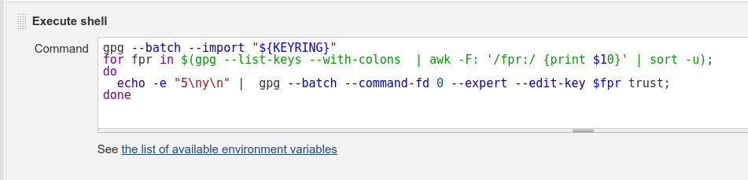

Jenkins is a continuous integration (CI) server. It is in use on Eclipse
servers for Eclipse projects as part of the [Common Build Infrastructure
(CBI)](CBI). This page is about the hosted service at
Eclipse.org. For more information on the project itself, or to download
Jenkins, please see the [Jenkins project](https://jenkins.io) page.

# General Information

Jenkins instances are maintained by the Eclipse Webmasters/Release
Engineers.

  - List of Jenkins Instances Per Project (JIPP):
      - https://ci.eclipse.org/ (cluster-based infra)

## Asking for Help

  - Need help actually building your code: ask your project mentors, or
    ask on the Common Build mailing list (cbi-dev). There are no dumb
    questions.
  - Subscribe to cbi-dev here:
    <https://dev.eclipse.org/mailman/listinfo/cbi-dev>

## Requesting a JIPP instance for CBI

Please see
[CBI\#Requesting_a_JIPP_instance](CBI#Requesting_a_JIPP_instance)

# Jenkins configuration and tools (clustered infra)

## Tools (and locations on the default JNLP agent container)

### Apache Maven

  - apache-maven-latest `/opt/tools/apache-maven/latest` = **3.8.2**
  - apache-maven-3.8.3 `/opt/tools/apache-maven/3.8.3`
  - apache-maven-3.8.2 `/opt/tools/apache-maven/3.8.2`
  - apache-maven-3.8.1 `/opt/tools/apache-maven/3.8.1`
  - apache-maven-3.6.3 `/opt/tools/apache-maven/3.6.3`
  - apache-maven-3.6.0 `/opt/tools/apache-maven/3.6.0`
  - apache-maven-3.5.4 `/opt/tools/apache-maven/3.5.4`
  - apache-maven-3.3.9 `/opt/tools/apache-maven/3.3.9`
  - apache-maven-3.2.5 `/opt/tools/apache-maven/3.2.5`

### JDK

#### OpenJDK

The binaries listed below come from <http://jdk.java.net> and are built
by Oracle. These are production-ready open-source builds of the Java
Development Kit, an implementation of the Java SE Platform under the
[GNU General Public License, version 2, with the Classpath
Exception](http://openjdk.java.net/legal/gplv2+ce.html). See the
differences between these binaries and Oracle's one for version 11
onward on [Oracle's director of product management blog
post](https://blogs.oracle.com/java-platform-group/oracle-jdk-releases-for-java-11-and-later).

Note that Oracle does not provide security updates for long-term support
(LTS) releases for these open source binaries. It means that it is not
safe to run any production code on any other version but the latest
update of the latest JDK version. Archive builds are available at
<http://jdk.java.net/archive/>.

openjdk-latest always points to the latest GA release.

  - openjdk-latest `/opt/tools/java/openjdk/latest` = **17.0.1 (GA)**
  - openjdk-ea-latest (**EA**) `/opt/tools/java/openjdk/ea-latest` =
    **18-ea+22**
  - openjdk-jdk18-latest (**EA**)
    `/opt/tools/java/openjdk/jdk-18/latest` = **18-ea+22**
  - openjdk-jdk17-latest `/opt/tools/java/openjdk/jdk-17/latest` =
    **17.0.1 (GA)**
  - openjdk-jdk16-latest `/opt/tools/java/openjdk/jdk-16/latest` =
    **16.0.2**
  - openjdk-jdk15-latest `/opt/tools/java/openjdk/jdk-15/latest` =
    **15.0.2+7**
  - openjdk-jdk14-latest `/opt/tools/java/openjdk/jdk-14/latest` =
    **14.0.2+12**
  - openjdk-jdk13-latest `/opt/tools/java/openjdk/jdk-13/latest` =
    **13.0.2+8**
  - openjdk-jdk12-latest `/opt/tools/java/openjdk/jdk-12/latest` =
    **12.0.2+10**
  - openjdk-jdk11-latest `/opt/tools/java/openjdk/jdk-11/latest` =
    **11.0.2+9**
  - openjdk-jdk10-latest `/opt/tools/java/openjdk/jdk-10/latest` =
    **10.0.2+13**
  - openjdk-jdk9-latest `/opt/tools/java/openjdk/jdk-9/latest` =
    **9.0.4+11**

#### AdoptOpenJDK

The binaries listed below come from <https://adoptopenjdk.net>. These
OpenJDK binaries are built from a fully open source set of [build
scripts](https://github.com/AdoptOpenJDK/openjdk-build) and
infrastructure.

##### With HotSpot

  - adoptopenjdk-hotspot-latest
    `/opt/tools/java/adoptopenjdk/hotspot-latest` = **16.0.2+7**
  - adoptopenjdk-hotspot-latest-lts
    `/opt/tools/java/adoptopenjdk/hotspot-lts-latest` = **11.0.11+9**
  - adoptopenjdk-hotspot-jdk16-latest
    `/opt/tools/java/adoptopenjdk/hotspot-jdk-16/latest` = **16.0.2+7**
  - adoptopenjdk-hotspot-jdk15-latest
    `/opt/tools/java/adoptopenjdk/hotspot-jdk-15/latest` = **15.0.2+7**
  - adoptopenjdk-hotspot-jdk14-latest
    `/opt/tools/java/adoptopenjdk/hotspot-jdk-14/latest` = **14.0.2+12**
  - adoptopenjdk-hotspot-jdk13-latest
    `/opt/tools/java/adoptopenjdk/hotspot-jdk-13/latest` = **13.0.2+8**
  - adoptopenjdk-hotspot-jdk12-latest
    `/opt/tools/java/adoptopenjdk/hotspot-jdk-12/latest` = **12.0.2+10**
  - adoptopenjdk-hotspot-jdk11-latest
    `/opt/tools/java/adoptopenjdk/hotspot-jdk-11/latest` = **11.0.11+9**
  - adoptopenjdk-hotspot-jdk10-latest
    `/opt/tools/java/adoptopenjdk/hotspot-jdk-10/latest` =
    **10.0.2+13.1**
  - adoptopenjdk-hotspot-jdk9-latest
    `/opt/tools/java/adoptopenjdk/hotspot-jdk-9/latest` = **9.0.4+11**
  - adoptopenjdk-hotspot-jdk8-latest
    `/opt/tools/java/adoptopenjdk/hotspot-jdk-8/latest` =
    **1.8.0_292-b10**

##### With OpenJ9

The binaries listed below replace the traditional HotSpot implementation
of the Java Virtual Machine implementation with [Eclipse
OpenJ9](https://www.eclipse.org/openj9/). Eclipse OpenJ9 is a high
performance, scalable, Java virtual machine implementation that is fully
compliant with the Java Virtual Machine Specification.

  - adoptopenjdk-openj9-latest
    `/opt/tools/java/adoptopenjdk/openj9-latest` = **16.0.2+7**
  - adoptopenjdk-openj9-latest-lts
    `/opt/tools/java/adoptopenjdk/openj9-lts-latest` = **11.0.11+9**
  - adoptopenjdk-openj9-jdk16-latest
    `/opt/tools/java/adoptopenjdk/openj9-jdk-16/latest` = **16.0.2+7**
  - adoptopenjdk-openj9-jdk15-latest
    `/opt/tools/java/adoptopenjdk/openj9-jdk-15/latest` = **15.0.2+7**
  - adoptopenjdk-openj9-jdk14-latest
    `/opt/tools/java/adoptopenjdk/openj9-jdk-14/latest` = **14.0.2+12**
  - adoptopenjdk-openj9-jdk13-latest
    `/opt/tools/java/adoptopenjdk/openj9-jdk-13/latest` = **13.0.2+8**
  - adoptopenjdk-openj9-jdk12-latest
    `/opt/tools/java/adoptopenjdk/openj9-jdk-12/latest` = **12.0.2+10**
  - adoptopenjdk-openj9-jdk11-latest
    `/opt/tools/java/adoptopenjdk/openj9-jdk-11/latest` = **11.0.11+9**
  - adoptopenjdk-openj9-jdk10-latest
    `/opt/tools/java/adoptopenjdk/openj9-jdk-10/latest` = **10.0.2+13**
  - adoptopenjdk-openj9-jdk9-latest
    `/opt/tools/java/adoptopenjdk/openj9-jdk-9/latest` = **9.0.4+12**
  - adoptopenjdk-openj9-jdk8-latest
    `/opt/tools/java/adoptopenjdk/openj9-jdk-8/latest` =
    **1.8.0_292-b10**

#### Eclipse Temurin

The binaries listed below come from <https://adoptium.net/>. These
OpenJDK binaries are built from a fully open source set of [build
scripts](https://github.com/adoptium) and infrastructure. All Temurin
binaries use the HotSpot JVM.

  - temurin-latest `/opt/tools/java/temurin/latest` = **17.0.1+12**
  - temurin-jdk17-latest `/opt/tools/java/temurin/jdk-17/latest` =
    **17.0.1+12**
  - temurin-jdk11-latest `/opt/tools/java/temurin/jdk-11/latest` =
    **11.0.13+8**
  - temurin-jdk8-latest `/opt/tools/java/temurin/jdk-8/latest` =
    **8u312-b07**

#### Oracle

The binaries listed below come from the [Oracle Technology
Network](https://www.oracle.com/technetwork/java/javase/downloads/index.html).
Note that Oracle JDK from version 11 onward (and 8u211 onward) is
licensed under the terms of the new [Oracle Technology Network (OTN)
License Agreement for Oracle Java
SE](https://www.oracle.com/technetwork/java/javase/terms/license/javase-license.html)
that *is substantially different from the licenses under which previous
versions of the JDK were offered*. Oracle JDK 10 and earlier versions
(and 8u202 and earlier versions) were released under the [Oracle Binary
Code License (BCL) for Java
SE](https://www.oracle.com/technetwork/java/javase/terms/license/index.html).

As such, starting with JDK 11, the Eclipse Foundation *will not* provide
any version of the Oracle JDK licensed under the -commercial- OTN terms.
Previous versions listed below, will stay available as is. See the
*cosmetic and packaging differences* between Oracle's OpenJDK Builds
(GPL+CE) — simply named [OpenJDK](#OpenJDK) above — and
Oracle JDK (OTN) on [Oracle Director of Product Management's blog
post](https://blogs.oracle.com/java-platform-group/oracle-jdk-releases-for-java-11-and-later).

  - oracle-latest `/opt/tools/java/oracle/latest` (=
    oracle-jdk10-latest)
  - oracle-jdk10-latest `/opt/tools/java/oracle/jdk-10/latest` =
    **10.0.2**
  - oracle-jdk9-latest `/opt/tools/java/oracle/jdk-9/latest` = **9.0.4**
  - oracle-jdk8-latest `/opt/tools/java/oracle/jdk-8/latest` =
    **1.8.0u202**
  - oracle-jdk7-latest `/opt/tools/java/oracle/jdk-7/latest` =
    **1.7.0u80**
  - oracle-jdk6-latest `/opt/tools/java/oracle/jdk-6/latest` =
    **1.6.0u45**
  - oracle-jdk5-latest `/opt/tools/java/oracle/jdk-5/latest` =
    **1.5.0u22**

If your build requires JDK 1.4, please consider upgrading to at least
JDK 5. If that's not possible, you will need to create a custom docker
image.

#### IBM

The binaries listed below come from [IBM SDK, Java Technology
Edition](https://developer.ibm.com/javasdk/downloads/).

  - ibm-latest `/opt/tools/java/ibm/latest` (= ibm-jdk8-latest)
  - ibm-jdk8-latest `/opt/tools/java/ibm/jdk-8/latest` = **8.0.5.27**

### Ant

  - apache-ant-latest (1.10.5, automatically installed from Apache
    server)

## Default plugins - Jiro

<div style="column-count:4;-moz-column-count:4;-webkit-column-count:4">

  - ace-editor
  - analysis-core
  - ant
  - antisamy-markup-formatter
  - apache-httpcomponents-client-4-api
  - authentication-tokens
  - bouncycastle-api
  - branch-api
  - build-timeout
  - cloudbees-folder
  - command-launcher
  - conditional-buildstep
  - config-file-provider
  - configuration-as-code
  - configuration-as-code-support
  - credentials
  - credentials-binding
  - display-url-api
  - docker-commons
  - docker-workflow
  - durable-task
  - email-ext
  - extended-read-permission
  - extra-columns
  - gerrit-trigger
  - ghprb
  - git
  - git-client
  - git-parameter
  - git-server
  - github
  - github-api
  - github-branch-source
  - greenballs
  - handlebars
  - jackson2-api
  - javadoc
  - jdk-tool
  - jobConfigHistory
  - jquery
  - jquery-detached
  - jsch
  - junit
  - kubernetes
  - kubernetes-credentials
  - ldap
  - lockable-resources
  - mailer
  - matrix-auth
  - matrix-project
  - maven-plugin
  - momentjs
  - parameterized-trigger
  - pipeline-build-step
  - pipeline-graph-analysis
  - pipeline-input-step
  - pipeline-maven
  - pipeline-milestone-step
  - pipeline-model-api
  - pipeline-model-declarative-agent
  - pipeline-model-definition
  - pipeline-model-extensions
  - pipeline-rest-api
  - pipeline-stage-step
  - pipeline-stage-tags-metadata
  - pipeline-stage-view
  - plain-credentials
  - promoted-builds
  - rebuild
  - resource-disposer
  - run-condition
  - scm-api
  - script-security
  - simple-theme-plugin
  - sonar
  - ssh-agent
  - ssh-credentials
  - ssh-slaves
  - structs
  - timestamper
  - token-macro
  - variant
  - warnings-ng
  - windows-slaves
  - workflow-aggregator
  - workflow-api
  - workflow-basic-steps
  - workflow-cps
  - workflow-cps-global-lib
  - workflow-durable-task-step
  - workflow-job
  - workflow-multibranch
  - workflow-scm-step
  - workflow-step-api
  - workflow-support
  - ws-cleanup
  - xvnc

</div>

## FAQ


### How do I run a Java/Maven build on the cluster-based infra?

The most simple way is to create a Jenkinsfile in your git repo and
create a multi branch pipeline job in your Jenkins instance. See
<https://jenkins.io/doc/pipeline/tour/hello-world/> for more
information. See below a simple Jenkinsfile. Note that the full list of
available tools name can be found in the
[tools](#Tools_\(and_locations_on_the_default_JNLP_agent_container\))
section of this page.

``` groovy
pipeline {
    agent any
    tools {
        maven 'apache-maven-latest'
        jdk 'adoptopenjdk-hotspot-jdk8-latest'
    }
    stages {
        stage('Build') {
            steps {
                sh '''
                    java -version
                    mvn -v
                '''
            }
        }
    }
    post {
        // send a mail on unsuccessful and fixed builds
        unsuccessful { // means unstable || failure || aborted
            emailext subject: 'Build $BUILD_STATUS $PROJECT_NAME #$BUILD_NUMBER!',
            body: '''Check console output at $BUILD_URL to view the results.''',
            recipientProviders: [culprits(), requestor()],
            to: 'other.recipient@domain.org'
        }
        fixed { // back to normal
            emailext subject: 'Build $BUILD_STATUS $PROJECT_NAME #$BUILD_NUMBER!',
            body: '''Check console output at $BUILD_URL to view the results.''',
            recipientProviders: [culprits(), requestor()],
            to: 'other.recipient@domain.org'
        }
    }
}
```

### How do I run UI-tests on the cluster-based infra?

  - In general, you can use a pre-built/custom docker image and Jenkins
    pipelines, see
    <https://wiki.eclipse.org/Jenkins#How_do_I_run_my_build_in_a_custom_container.3F>.
  - If your project requires specific dependencies, you can try to use
    the "centos-7" pod template. If it does not work, use a
    pre-build/custom docker image.

For **freestyle jobs** the label can be specified in the job
configuration under "Restrict where this project can be run":


Example for **pipeline jobs**:

``` groovy
pipeline {
    agent {
        kubernetes {
            label 'centos-7'
        }
    }
    tools {
        maven 'apache-maven-latest'
        jdk 'adoptopenjdk-hotspot-jdk8-latest'
    }
    stages {
        stage('Build') {
            steps {
                wrap([$class: 'Xvnc', takeScreenshot: false, useXauthority: true]) {
                  sh 'mvn clean verify'
                }
            }
        }
    }
}
```

### Common build errors

#### Why are there no build executors? Why are build executors offline/suspended and/or builds never start?

On our cluster-based infrastructure all build executors/agents/pods
(except on dedicated agents) are dynamically spun up. This usually takes
a little while. Therefore the build executor status panel might show
something like

  - "(pending—Waiting for next available executor)" or
  - "my-agent-abcd123 is offline or suspended"

for a few seconds, before the build starts. We've opened [a ticket with
a suggestion on the Jenkins
project](https://issues.jenkins-ci.org/browse/JENKINS-56307) to speed up
the provisioning process. Feel free to vote on this issue if you feel it
is important for you.

If such a message is shown for more than \~5 minutes, you can safely
assume that something is wrong with the pod/container config. For
example: a docker image can't be found because there is a typo in the
name or the tag was wrong.

#### What is killing my build? I'm using custom containers\!

A good indicator that your build is aborted due to an OutOfMemory error
is the word "Killed" appearing in the console logs.

First, please get familiarized with how [Kubernetes assigns memory
resources to containers and
pods](https://kubernetes.io/docs/tasks/configure-pod-container/assign-memory-resource/)

Then, you should know that, as soon as you run your build in a custom
Kubernetes agent, Jenkins adds a container named "jnlp" that will handle
the connection between the pod agent and the master. The resources
assigned to this "jnlp" container come from a default values we set for
you. Because we know the "jnlp" container does not use need of cpu and
memory, we set the default values for all containers to low values
(about 512MiB and 0.25 vCPU). This way, we're sure that the "jnlp"
container won't uselessly consume too much resources that are allocated
to your project. But this has the negative effect that, if you don't
effectively specify the resources requests and limits in your pod
template, your custom containers will also inherit those values (which
are probably too low for you). To overcome the issue, you need to
specify those values in your pod template like:

``` groovy
pipeline {
  agent {
    kubernetes {
      label 'my-agent-pod'
      yaml """
apiVersion: v1
kind: Pod
spec:
  containers:
  - name: maven
    image: maven:alpine
    command:
    - cat
    tty: true
    resources:
      limits:
        memory: "2Gi"
        cpu: "1"
      requests:
        memory: "2Gi"
        cpu: "1"
"""
    }
  }
  stages {
    stage('Run maven') {
      steps {
        container('maven') {
          sh 'mvn -version'
        }
      }
    }
  }
}
```

Note that if you run multiple containers, you need to specify the limits
for each.

We plan to develop some tooling to automatically inject correct default
values for your custom containers depending on the resource quotas and
the concurrency level (i.e. how many agent can run at once) assigned to
your project [GitHub Issue
\#20](https://github.com/eclipse-cbi/jiro/issues/20).

#### My build fails with: 'FATAL: Cannot run program "Xvnc"', what do I need to do?

You are most likely running UI tests that require a desktop environment
and a VNC server. The default pod template does not provide such an
environment. Therefore you will need to use a different pod template or
a custom docker image.

**The CentOS 7 pod template (label: "centos-7") can be used for UI
tests.** This docker image should be quite close to the environment on
the old infrastructure.

See
<https://wiki.eclipse.org/Jenkins#How_do_I_run_UI-tests_on_the_new_infra.3F>
on how the pod template can be used with freestyle or pipeline jobs.

#### My build fails with: "\[ERROR\] Unrecognized VM option '+UseContainerSupport'", what do I need to do?

Your build is still running with a JDK &lt; 8 (e.g. JDK 6). **Since these
are really old and unsupported JDKs we urge you to switch to a more
recent JDK, at least JDK 8.** If that's not immediately possible - for
reasons - you will need to use the following workaround:

Unset the environment variables "JAVA_TOOL_OPTIONS" an
"_JAVA_OPTIONS" by creating two string build parameters with the those
names:

1.  In the Jenkins job configuration select "This project is
    parameterized"
2.  Add parameter -\> String parameter
3.  Set name "JAVA_TOOL_OPTIONS"
4.  Leave default value empty
5.  Repeat 2.-4. for "_JAVA_OPTIONS"

#### My build fails with "No user exists for uid 1000100000", what's the issue?

First, you need to know that we run containers using an arbitrarily
assigned user ID (1000100000) in our OpenShift cluster. This is for
security reasons.

Unfortunately, most of images you can find on DockerHub (including
official images) do not support running as an arbitrary user. Actually,
most of them expect to run as root, which is definitely a [bad
practice](https://medium.com/@mccode/processes-in-containers-should-not-run-as-root-2feae3f0df3b).
See also question below about [how to run a container as
root](#How_can_I_run_my_build_in_a_container_with_root_privileges?).

Moreover, some programs like `ssh` search for a mapping between the user
ID (1000100000) and a user name on the system (here a container). It's
very rare that any container anticipate this need and actually created a
user with ID=1000100000. To avoid this error, you need to customize the
image. OpenShift publishes [guidelines with best
practices](https://docs.openshift.com/container-platform/3.9/creating_images/guidelines.html)
about how to create Docker images. More specifically, see the section
about how to [support running with arbitrary user
ID](https://docs.openshift.com/container-platform/3.9/creating_images/guidelines.html#use-uid).

In order to make your image call the uid_entrypoint as listed in the
link above, you will need to add it to the command directive in the pod
template, e.g.:

``` groovy
pipeline {
  agent {
    kubernetes {
      label 'my-pod'
      yaml '''
apiVersion: v1
kind: Pod
spec:
  containers:
  - name: custom-container
    image: 'custom/image'
    command: [ "/usr/local/bin/uid_entrypoint" ]
    args: [ "cat" ]
    tty: true
'''
    }
  }
  stages {
    stage('Stage 1') {
      steps {
        container('custom-container') {
          sh 'whoami'
        }
      }
    }
  }
}
```

If you want to see in practice, have a look at some images we've defined
to run in the cluster on this [GitHub
repository](https://github.com/eclipse-cbi/dockerfiles).

#### My build fails with "Host key verification failed", what should I do?

As long as you stay in the default `jnlp` docker image (i.e. use a
Freestyle Job or a Pipeline job without custom pod template), you'll
benefit from our existing configuration where we mount a `known_hosts`
file in the `~/.ssh` folder of all containers.

If you define a custom pod template, you need to add some configuration
to mount this [config
map](https://kubernetes.io/docs/tasks/configure-pod-container/configure-pod-configmap/)
in your containers. The only thing that you have to know is the config
map name **known-hosts** and mount it at the proper location
`/home/jenkins/.ssh`.

``` groovy
pipeline {
  agent {
    kubernetes {
      label 'my-agent-pod'
      yaml """
apiVersion: v1
kind: Pod
spec:
  containers:
  - name: maven
    image: maven:alpine
    command:
    - cat
    tty: true
    volumeMounts:
    - name: volume-known-hosts
      mountPath: /home/jenkins/.ssh
  volumes:
  - name: volume-known-hosts
    configMap:
      name: known-hosts
"""
    }
  }
  stages {
    ...
  }
}
```

Currently, the known_hosts file we provide as the key for the following
sites:

  - git.eclipse.org:22
  - git.eclipse.org:29418
  - build.eclipse.org
  - github.com

If you need any other site to be added, feel free to [open a
request](https://bugs.eclipse.org/bugs/enter_bug.cgi?product=Community&component=CI-Jenkins).

#### If I try to run builds on ‘master’ they never start. What is wrong?

On our build cluster all builds are executed on dynamic or static build
agents. The master instance has no executors and therefore can not run
any builds itself.

In case of pipeline jobs, it might appear as if the master is building,
but it only handles the workflow of the tasks defined in the pipeline
and post-build tasks, never the actually build steps.

#### My build is sometime taking twice as long to complete? Is there an issue with the cluster?

First thing to do when you think that a build is slow, is to compare it
with several other run over the course of a couple of days and
relativize. We consider a single build being slow not only by comparing
the average build time, but taking into account the standard deviation
of the build time history.

You should keep in mind that when running on a clustered agent, CPU is
always requested as an absolute quantity, never as a relative quantity;
0.1 is the same amount of CPU on a single-core, dual-core, or 48-core
machine. Also, the CPU resources assigned to containers are absolute and
not relative to the clock speed of the CPUs. On the cluster we currently
have some machines with 3.70GHz CPU cores and others with 2.00GHz CPU
cores. So, depending on which node you jobs are schedule to run on, the
*performances may vary*. We will eventually streamline the machines on
the cluster and reserve higher performance nodes for build jobs and keep
lower performance ones for other tasks. But during the migration and
until the JIPP machines from the old infra are moved to the cluster, we
need those less performant machines to keep up with the requested
compute resources.

#### I've updated my custom image and reference but the older one is still being used somehow.

This could be related to
[JENKINS-47759](https://issues.jenkins-ci.org/browse/JENKINS-47759) (See
[Bug 565044](https://bugs.eclipse.org/bugs/show_bug.cgi?id=565044))
Instead of a pod label like "my-agent-pod", consider using a label like
"my-agent-pod + '-' + env.BUILD_NUMBER".

#### Where is my build workspace? I see "Error: No workspace"

On our new cluster-based infrastructure, all builds run in dynamically
created docker containers. After the build, the containers are destroyed
and the workspace vanishes.

Build artifacts can be archived (as before) by using the "archive
artifacts" post-build action. If you need to access log files, etc. (for
debugging purposes), you can archive them as well.

We understand that this can be inconvenient, especially when debugging a
failing build. One possible workaround is to use "sleep" in a shell
build step (e.g. for 10min) at the end, to be able to access the
workspace after the build.

### Custom container

#### How do I run my build in a custom container?

You need to use a Jenkins pipeline to do so. Then you can specify a
Kubernetes pod template. See an example below.

You can either use already existing "official" docker images, for
example the <code>maven: &lt;version&gt;-alpine</code> images or create your own custom
docker image.

**Important:** Docker images need to be hosted on supported registries. We currently support:  **docker.io**, **quay.io** and **gcr.io**

**Important:** Currently, docker images can **not be built** (as in created) on our Jenkins CI instances.
See also: https://wiki.eclipse.org/Jenkins#I_want_to_build_a_custom_Docker_image_.28with_docker_build.29.2C_but_it_does_not_work._What_should_I_do.3F

``` groovy
pipeline {
  agent {
    kubernetes {
      label 'my-agent-pod'
      yaml """
apiVersion: v1
kind: Pod
spec:
  containers:
  - name: maven
    image: maven:alpine
    command:
    - cat
    tty: true
  - name: php
    image: php:7.2.10-alpine
    command:
    - cat
    tty: true
  - name: hugo
    image: eclipsecbi/hugo:0.81.0
    command:
    - cat
    tty: true
"""
    }
  }
  stages {
    stage('Run maven') {
      steps {
        container('maven') {
          sh 'mvn -version'
        }
        container('php') {
          sh 'php -version'
        }
        container('hugo') {
          sh 'hugo -version'
        }
      }
    }
  }
}
```

See the [Kubernetes Jenkins
plugin](https://github.com/jenkinsci/kubernetes-plugin) for more
documentation.

#### How can I run my build in a container with root privileges?

Unfortunately, for security reasons, you cannot do that. We run an
infrastructure open to the internet, which potentially runs stuff from
non-trusted code (e.g., PR) so we need to follow a strict policy to
protect the common good.

More specifically, we run containers using an arbitrarily assigned user
ID (e.g. 1000100000) in our OpenShift cluster. The group ID is always
root (0) though. The [security context
constraints](https://docs.openshift.com/container-platform/3.9/admin_guide/manage_scc.html)
we use for running projects' containers is "restricted". You cannot
change this level from your podTemplate.

Unfortunately, most of images you can find on DockerHub (including
official images) do not support running as an arbitrary user. Actually,
most of them expect to run as root, which is definitely a [bad
practice](https://medium.com/@mccode/processes-in-containers-should-not-run-as-root-2feae3f0df3b).

OpenShift publishes [guidelines with best
practices](https://docs.openshift.com/container-platform/3.9/creating_images/guidelines.html)
about how to create Docker images. More specifically, see the section
about how to [support running with arbitrary user
ID](https://docs.openshift.com/container-platform/3.9/creating_images/guidelines.html#use-uid).

To test if an image is ready to be run with an arbitrarily assigned user
ID, you can try to start it with the following command line:

`  $ docker run -it --rm -u $((1000100000 + RANDOM % 100000)):0 image/name:tag`

#### I want to build a custom Docker image (with `docker build`), but it does not work. What should I do?

You cannot currently build images on the cluster (i.e. `docker build`
does not work). We plan to address this shortcoming shortly.

#### How do I use /opt/tools in a custom container?

You need to specify the tools persistence volume.

``` groovy
pipeline {
  agent {
    kubernetes {
      label 'my-agent-pod'
      yaml """
apiVersion: v1
kind: Pod
spec:
  containers:
  - name: custom-name
    image: my-custom-image:latest
    tty: true
    command:
    - cat
    volumeMounts:
    - name: tools
      mountPath: /opt/tools
  volumes:
  - name: tools
    persistentVolumeClaim:
      claimName: tools-claim-jiro-<project_shortname>
"""
    }
  }
  stages {
    stage('Run maven') {
      steps {
        container('custom-name') {
          sh '/opt/tools/apache-maven/latest/bin/mvn -version'
        }
      }
    }
  }
}
```
**Important:** Do not forget to replace <code>&lt;project_shortname&gt;</code> in the claimName with your project name (e.g. <code>tools-claim-jiro-cbi</code> for the CBI project).

#### In a custom container the build can't write to /home/jenkins, what do I need to do?

Due to recent changes in the Jenkins Kubernetes plugin, you need to
specify an empty dir volume for /home/jenkins, if your build uses a
directory like /home/jenkins/.ivy2 or /home/jenkins/.npm.

``` groovy
pipeline {
  agent {
    kubernetes {
      label 'my-agent-pod'
      yaml """
apiVersion: v1
kind: Pod
spec:
  containers:
  - name: custom-name
    image: my-custom-image:latest
    tty: true
    command:
    - cat
    volumeMounts:
    - mountPath: "/home/jenkins"
      name: "jenkins-home"
      readOnly: false
  volumes:
  - name: "jenkins-home"
    emptyDir: {}
"""
    }
  }
  stages {
    stage('Run maven') {
      steps {
        container('custom-name') {
          sh 'mkdir -p /home/jenkins/foobar'
        }
      }
    }
  }
}
```

**Note:** We are not satisfied with this workaround and are actively looking for a more convenient way to let projects use custom containers without specifying a bunch of volume mounts.

### How do I deploy artifacts to download.eclipse.org?

You cannot just `cp` stuff to a folder. You need to do that with `ssh`.
Therefore SSH credentials need to be set up on the project's Jenkins
instance. This is already set up by default for all instances on our
infrastructure.

This service provide access to the Eclipse Foundation file servers
storage:

  - `/home/data/httpd/download.eclipse.org`
  - `/home/data/httpd/archive.eclipse.org`
  - `/home/data/httpd/download.polarsys.org`
  - `/home/data/httpd/download.locationtech.org`

Depending on how you run your build, the way you will use them are
different. See the different cases below.

#### Freestyle job

You need to activate the *SSH Agent* plugin in your job configuration
and select the proper credentials `genie.`*`projectname`*`
(ssh://projects-storage.eclipse.org) `.


Then you can use `ssh`, `scp`, `rsync` and `sftp` commands to deploy
artifacts to the server, e.g.,

``` bash
scp -o BatchMode=yes target/my_artifact.jar genie.<projectname>@projects-storage.eclipse.org:/home/data/httpd/download.eclipse.org/<projectname>/
ssh -o BatchMode=yes genie.<projectname>@projects-storage.eclipse.org ls -al /home/data/httpd/download.eclipse.org/<projectname>/
rsync -a -e ssh <local_dir> genie.<projectname>@projects-storage.eclipse.org:/home/data/httpd/download.eclipse.org/<projectname>/
```

#### Deployment with Maven

It is possible to deploy build output from within Maven, using Maven
Wagon and wagon-ssh-external. As the build environment uses an SSH
agent, the Maven Wagon plugins must use the external SSH commands so
that the agent is used.

If the build outputs are executables or p2 update site and not Maven
artifacts then the standard maven deploy needs to be disabled. E.g. with
this in the appropriate profile in the parent/pom.xml

``` xml
<plugin>
    <artifactId>maven-deploy-plugin</artifactId>
    <configuration>
        <skip>true</skip>
    </configuration>
</plugin>
```

Define some properties for the destination in parent/pom.xml:

``` xml
<download-publish-path>/home/data/httpd/download.eclipse.org/[projectname]/snapshots/update-site</download-publish-path>
<download-remote-publish-path>genie.[projectname]@projects-storage.eclipse.org:/home/data/httpd/download.eclipse.org/[projectname]/snapshots/update-site</download-remote-publish-path>
```

Define the Wagon transport in parent/pom.xml:

``` xml
<build>
    <plugins>
        <plugin>
                ...
        </plugin>
    </plugins>
    <extensions>
        <extension>
            <groupId>org.apache.maven.wagon</groupId>
            <artifactId>wagon-ssh-external</artifactId>
            <version>3.0.0</version>
        </extension>
    </extensions>
</build>
```

Do the actual upload during the deploy phase (be sure to add that to the
Maven invocation).

``` xml
<plugin>
    <groupId>org.codehaus.mojo</groupId>
    <artifactId>wagon-maven-plugin</artifactId>
    <version>2.0.0</version>
    <executions>
        <execution>
            <id>prepare-publish</id>
            <phase>deploy</phase>
            <goals>
                <goal>sshexec</goal>
            </goals>
            <configuration>
                <url>scpexe://${download-remote-publish-path}</url>
                <commands>
                    <command>rm -rf ${download-publish-path}/*</command>
                </commands>
            </configuration>
        </execution>
        <execution>
            <id>publish</id>
            <phase>deploy</phase>
            <goals>
                <goal>upload</goal>
            </goals>
            <configuration>
                <fromDir>target/repository</fromDir>
                <includes>*/**</includes>
                <url>scpexe://${download-remote-publish-path}</url>
                <toDir></toDir>
            </configuration>
        </execution>
    </executions>
</plugin>
```

This uses the sshexec goal to delete old files and upload to copy new
files. Note \*/\*\* for all directories. &lt;toDir&gt;&lt;/toDir&gt; appears to be
relative to the path given in the URL.

Be careful with paths and properties to ensure you upload to the correct
place and do not delete the wrong thing.

Eclipse Memory Analyzer uses the above with Maven Wagon to deploy the
snapshot nightly builds.

#### Pipeline job without custom pod template

``` groovy
pipeline {
  agent any

  stages {
    stage('stage 1') {
      ...
    }
    stage('Deploy') {
      steps {
        sshagent ( ['projects-storage.eclipse.org-bot-ssh']) {
          sh '''
            ssh -o BatchMode=yes genie.projectname@projects-storage.eclipse.org rm -rf /home/data/httpd/download.eclipse.org/projectname/snapshots
            ssh -o BatchMode=yes genie.projectname@projects-storage.eclipse.org mkdir -p /home/data/httpd/download.eclipse.org/projectname/snapshots
            scp -o BatchMode=yes -r repository/target/repository/* genie.projectname@projects-storage.eclipse.org:/home/data/httpd/download.eclipse.org/projectname/snapshots
          '''
        }
      }
    }
  }
}
```

#### Pipeline job with custom pod template

**Important:** A 'jnlp' container is automatically added, when a custom pod template is used to ensure connectivity
between the Jenkins master and the pod. If you want to deploy files to download.eclipse.org, you only need to specify
the known-hosts volume for the JNLP container (as seen below) to avoid "host verification failed" errors.

``` groovy
pipeline {
  agent {
    kubernetes {
      label 'my-pod'
      yaml '''
apiVersion: v1
kind: Pod
spec:
  containers:
  - name: maven
    image: maven:alpine
    command:
    - cat
    tty: true
  - name: jnlp
    volumeMounts:
    - name: volume-known-hosts
      mountPath: /home/jenkins/.ssh
  volumes:
  - name: volume-known-hosts
    configMap:
      name: known-hosts
'''
    }
  }
  stages {
    stage('Build') {
      steps {
        container('maven') {
            sh 'mvn clean verify'
        }
      }
    }
    stage('Deploy') {
      steps {
        container('jnlp') {
          sshagent ( ['projects-storage.eclipse.org-bot-ssh']) {
            sh '''
              ssh -o BatchMode=yes genie.projectname@projects-storage.eclipse.org rm -rf /home/data/httpd/download.eclipse.org/projectname/snapshots
              ssh -o BatchMode=yes genie.projectname@projects-storage.eclipse.org mkdir -p /home/data/httpd/download.eclipse.org/projectname/snapshots
              scp -o BatchMode=yes -r repository/target/repository/* genie.projectname@projects-storage.eclipse.org:/home/data/httpd/download.eclipse.org/projectname/snapshots
            '''
          }
        }
      }
    }
  }
}
```

### How do I use the local Nexus server as proxy for Maven Central (artifact caching)?

Every JIPP has a Maven settings file set up that specifies our [local Nexus instance](https://repo.eclipse.org) as cache for Maven Central.

**Important:** In [Jiro](https://github.com/eclipse-cbi/jiro) this works out of the box for the default pod templates (labels: basic, centos-7).
No additional configuration is required for Freestyle and Pipeline jobs. For custom containers, see below:
[Custom container on Jiro](https://wiki.eclipse.org/Jenkins#Custom_container_on_Jiro)

#### Custom container on Jiro

You need to add the settings-xml volume, like shown below. Please note,
the m2-repo volume is required as well, otherwise
/home/jenkins/.m2/repository is not writable.

**Note:** In custom containers the <code>user.home</code> environment variable needs to be set to <code>/home/jenkins</code> via MAVEN_OPTS, otherwise settings.xml and settings-security.xml can not be found.

``` groovy
pipeline {
  agent {
    kubernetes {
      label 'my-agent-pod'
      yaml """
apiVersion: v1
kind: Pod
spec:
  containers:
  - name: maven
    image: maven:alpine
    tty: true
    command:
    - cat
    env:
    - name: "MAVEN_OPTS"
      value: "-Duser.home=/home/jenkins"
    volumeMounts:
    - name: settings-xml
      mountPath: /home/jenkins/.m2/settings.xml
      subPath: settings.xml
      readOnly: true
    - name: m2-repo
      mountPath: /home/jenkins/.m2/repository
  volumes:
  - name: settings-xml
    secret:
      secretName: m2-secret-dir
      items:
      - key: settings.xml
        path: settings.xml
  - name: m2-repo
    emptyDir: {}
"""
    }
  }
  stages {
    stage('Run maven') {
      steps {
        container('maven') {
          sh 'mvn -version'
        }
      }
    }
  }
}
```

### How can artifacts be deployed to Nexus OSS (repo.eclipse.org)?

If your project does not have its own repo on Nexus yet, then simply
[file a
bug](https://bugs.eclipse.org/bugs/enter_bug.cgi?product=Community&component=Nexus)
and specify what project you'd like a Nexus repo for.

If your project does have its own repo on Nexus already, then you can
use Maven (or Gradle) to deploy your artifacts. This is also described
here:
<https://wiki.eclipse.org/Services/Nexus#Deploying_artifacts_to_repo.eclipse.org>.

**Note:** On our cluster-based infra (Jiro), a separate Maven settings file for deployment to Nexus is not required.
All information is contained in the default Maven settings file located at
<code>/home/jenkins/.m2/settings.xml</code>, which does not need to be specified explicitly
in your job configuration.

#### Custom container on Jiro

You need to add the settings-xml volume, like shown below. Please note,
the m2-repo volume is required as well, otherwise
/home/jenkins/.m2/repository is not writable.

**Note:** In custom containers the <code>user.home</code> environment variable needs to
be set to <code>/home/jenkins</code> via MAVEN_OPTS, otherwise settings.xml and settings-security.xml can not be found.

``` groovy
pipeline {
  agent {
    kubernetes {
      label 'my-agent-pod'
      yaml """
apiVersion: v1
kind: Pod
spec:
  containers:
  - name: maven
    image: maven:alpine
    tty: true
    command:
    - cat
    env:
    - name: "MAVEN_OPTS"
      value: "-Duser.home=/home/jenkins"
    volumeMounts:
    - name: settings-xml
      mountPath: /home/jenkins/.m2/settings.xml
      subPath: settings.xml
      readOnly: true
    - name: settings-security-xml
      mountPath: /home/jenkins/.m2/settings-security.xml
      subPath: settings-security.xml
      readOnly: true
    - name: m2-repo
      mountPath: /home/jenkins/.m2/repository
  volumes:
  - name: settings-xml
    secret:
      secretName: m2-secret-dir
      items:
      - key: settings.xml
        path: settings.xml
  - name: settings-security-xml
    secret:
      secretName: m2-secret-dir
      items:
      - key: settings-security.xml
        path: settings-security.xml
  - name: m2-repo
    emptyDir: {}
"""
    }
  }
  stages {
    stage('Run maven') {
      steps {
        container('maven') {
          sh 'mvn clean deploy'
        }
      }
    }
  }
}
```

### How can artifacts be deployed to OSSRH / Maven Central?

Deploying artifacts to OSSRH (OSS Repository Hosting provided by
Sonatype) requires an account at OSSRH. It is also required to sign all
artifacts with GPG. The Eclipse IT team will set this up for the
project.
**Please [file a
bug](https://bugs.eclipse.org/bugs/enter_bug.cgi?product=Community&component=CI-Jenkins&short_desc=OSSRH%20setup%20for%20project%20XXX)
for this first.**

**Note:** On our cluster-based infra (Jiro), a separate Maven settings file for deployment to OSSRH is not necessary.
All information is contained in the default Maven settings file located at <code>/home/jenkins/.m2/settings.xml</code>,
which does not need to be specified explicitly in your job configuration.<br> If you are using a custom container,
please see https://wiki.eclipse.org/Jenkins#Custom_container_on_Jiro_3

#### Required steps for a freestyle job

1. Insert <code>secret-subkeys.asc</code> as secret file in job

  

2. Import GPG keyring with <code>--batch</code> and trust the keys non-interactively in a shell build step (before the Maven call)

  ```bash
  gpg --batch --import "${KEYRING}"
  for fpr in $(gpg --list-keys --with-colons  | awk -F: '/fpr:/ {print $10}' | sort -u);
  do
     echo -e "5\ny\n" |  gpg --batch --command-fd 0 --expert --edit-key $fpr trust;
  done
```


3. If a newer GPG version (&gt; 2.1+) is used, <code>--pinentry-mode loopback</code> needs to be added as gpg argument in the pom.xml. **This does not need to be added when using the "centos-7"/"migration" pod template (which uses GPG 2.0.22)!**

  ```xml
<plugin>
  <groupId>org.apache.maven.plugins</groupId>
  <artifactId>maven-gpg-plugin</artifactId>
  <version>1.6</version>
  <executions>
    <execution>
      <id>sign-artifacts</id>
        <phase>verify</phase>
        <goals>
          <goal>sign</goal>
        </goals>
        <configuration>
          <gpgArguments>
            <arg>--pinentry-mode</arg>
            <arg>loopback</arg>
          </gpgArguments>
        </configuration>
    </execution>
  </executions>
</plugin>
```

#### Required steps for a pipeline job

This is a simple pipeline job, that allows to test the GPG signing.

``` groovy
pipeline {
    agent any
    tools {
        maven 'apache-maven-latest'
        jdk 'adoptopenjdk-hotspot-jdk8-latest'
    }
    stages {
        stage('Build') {
            steps {
                sh "mvn -B -U archetype:generate -DgroupId=com.mycompany.app -DartifactId=my-app -DarchetypeArtifactId=maven-archetype-quickstart -DinteractiveMode=false"
                sh '''cat >my-app/pom.xml <<EOL
<project xmlns="http://maven.apache.org/POM/4.0.0" xmlns:xsi="http://www.w3.org/2001/XMLSchema-instance"
  xsi:schemaLocation="http://maven.apache.org/POM/4.0.0 http://maven.apache.org/maven-v4_0_0.xsd">
  <modelVersion>4.0.0</modelVersion>
  <groupId>com.mycompany.app</groupId>
  <artifactId>my-app</artifactId>
  <packaging>jar</packaging>
  <version>1.0-SNAPSHOT</version>
  <name>my-app</name>
  <url>http://maven.apache.org</url>
  <dependencies>
    <dependency>
      <groupId>junit</groupId>
      <artifactId>junit</artifactId>
      <version>3.8.1</version>
      <scope>test</scope>
    </dependency>
  </dependencies>
  <build>
    <plugins>
      <plugin>
        <groupId>org.apache.maven.plugins</groupId>
        <artifactId>maven-gpg-plugin</artifactId>
        <version>1.6</version>
        <executions>
          <execution>
            <id>sign-artifacts</id>
            <phase>verify</phase>
            <goals>
              <goal>sign</goal>
            </goals>
            <configuration>
              <gpgArguments>
                <arg>--pinentry-mode</arg>
                <arg>loopback</arg>
              </gpgArguments>
            </configuration>
          </execution>
        </executions>
      </plugin>
    </plugins>
  </build>
</project>
EOL'''
                withCredentials([file(credentialsId: 'secret-subkeys.asc', variable: 'KEYRING')]) {
                    sh 'gpg --batch --import "${KEYRING}"'
                    sh 'for fpr in $(gpg --list-keys --with-colons  | awk -F: \'/fpr:/ {print $10}\' | sort -u); do echo -e "5\ny\n" |  gpg --batch --command-fd 0 --expert --edit-key ${fpr} trust; done'
                }
                sh "mvn -B -f my-app/pom.xml clean verify"
                sh 'gpg --verify my-app/target/my-app-1.0-SNAPSHOT.jar.asc'
            }
        }
    }
}
```

#### Custom container on Jiro

When you are using a custom container on Jiro, you will need to add the
settings-xml and settings-security-xml volume, like shown below.

**Please note:**

  - the m2-repo volume is required as well, otherwise
    /home/jenkins/.m2/repository is not writable
  - the toolchains-xml volume is optional, but added for completeness
  - you also might need to add additional volumes like
    volume-known-hosts (as described here:
    <https://wiki.eclipse.org/Jenkins#How_do_I_deploy_artifacts_to_download.eclipse.org.3F>)

<!-- end list -->

``` groovy
pipeline {
  agent {
    kubernetes {
      label 'my-agent-pod'
      yaml """
apiVersion: v1
kind: Pod
spec:
  containers:
  - name: maven
    image: maven:alpine
    tty: true
    command:
    - cat
    volumeMounts:
    - name: settings-xml
      mountPath: /home/jenkins/.m2/settings.xml
      subPath: settings.xml
      readOnly: true
    - name: toolchains-xml
      mountPath: /home/jenkins/.m2/toolchains.xml
      subPath: toolchains.xml
      readOnly: true
    - name: settings-security-xml
      mountPath: /home/jenkins/.m2/settings-security.xml
      subPath: settings-security.xml
      readOnly: true
    - name: m2-repo
      mountPath: /home/jenkins/.m2/repository
  volumes:
  - name: settings-xml
    secret:
      secretName: m2-secret-dir
      items:
      - key: settings.xml
        path: settings.xml
  - name: toolchains-xml
    configMap:
      name: m2-dir
      items:
      - key: toolchains.xml
        path: toolchains.xml
  - name: settings-security-xml
    secret:
      secretName: m2-secret-dir
      items:
      - key: settings-security.xml
        path: settings-security.xml
  - name: m2-repo
    emptyDir: {}
"""
    }
  }
  stages {
    stage('Run maven') {
      steps {
        container('maven') {
          sh 'mvn -version'
        }
      }
    }
  }
}
```

#### Common issues with GPG

|                                                                              |                                                                                                                                            |
| ---------------------------------------------------------------------------- | ------------------------------------------------------------------------------------------------------------------------------------------ |
| **Error message**                                                            | **Solution**                                                                                                                               |
| gpg: signing failed: Not a tty                                               | GPG version \> 2.1 is used and `--pinentry-mode loopback` needs to be **added** to the maven-gpg-plugin config in the pom.xml (see above). |
| gpg: invalid option "--pinentry-mode"                                        | GPG version \< 2.1 is used and `--pinentry-mode loopback` needs to be **removed** from the maven-gpg-plugin config in the pom.xml          |
| gpg: no default secret key: No secret key gpg: signing failed: No secret key | GPG keyring needs to be imported (see above)                                                                                               |

### How can SonarCloud be integrated into a Jiro JIPP?

Integrating [SonarCloud](https://sonarcloud.io/) into a project's CI
builds is quite easy. Please open a Bugzilla issue for this and the
releng/webmaster team will help you set this up.

We're setting this up with the webmaster's SonarCloud.io account, so
there is no need to provide a SonarCloud token. To avoid leaking the
token in the console log, we store it as secret text (Jenkins
credentials).

We will configure the SonarQube Jenkins plugin to use SonarCloud to
achieve a slightly better integration with Jenkins. For example, a link
to SonarCloud will show up in the left menu of a job page.

#### Freestyle job

For a freestyle job configuration two things need to be done:

1.  Under "Build environment" enable "Use secret text(s) or file(s)",
    add "Secret text", name the variable "SONARCLOUD_TOKEN" and select
    the right credential (e.g. "Sonarcloud token").

2.  Either a shell build step or a Maven build step can be used to run
the sonar goal with the right parameters:
  ``` bash
mvn clean verify sonar:sonar -Dsonar.projectKey=<project-name> -Dsonar.organization=<organization> -Dsonar.host.url=${SONAR_HOST_URL} -Dsonar.login=${SONARCLOUD_TOKEN}
```

#### Pipeline job

For a pipeline job the following needs to be added:

``` groovy
withCredentials([string(credentialsId: 'sonarcloud-token', variable: 'SONARCLOUD_TOKEN')]) {
    withSonarQubeEnv('SonarCloud.io') {
        mvn clean verify sonar:sonar -Dsonar.projectKey=<project-name> -Dsonar.organization=<organization> -Dsonar.host.url=${SONAR_HOST_URL} -Dsonar.login=${SONARCLOUD_TOKEN}
    }
}
```

**Please note: &lt;project-name&gt; and &lt;organization&gt; should be replaced with
the corresponding project name and organization.**

### Can projects get admin access on their Jiro JIPP?

In general, we want to avoid handing out admin rights in the future. At
the same time, - in the spirit of configuration as code - we are
planning to allow projects to submit pull requests to our Jiro repo and
change the configuration of their CI instance. E.g. adding plugins, etc.
This will allow better tracking of configuration changes and rollback in
case of issues.

We understand that some projects heavily rely on their admin
permissions. We will make sure to find an amicable solution in those
cases.

### How can a new plugin be added to a Jiro JIPP?

The preferred way is to open a pull request in the Jiro GitHub repo. For
example, to add a new plugin to the CBI instance, one would need to edit
<https://github.com/eclipse-cbi/jiro/blob/master/instances/technology.cbi/config.jsonnet>
and add the ID of the plugin to the plugins+ section. If the
jenkins+/plugins+ section does not exist yet, it needs to be added as
well.

Example:

``` javascript
{
  project+: {
    fullName: "technology.cbi",
    displayName: "Eclipse CBI",
  },
  jenkins+: {
    plugins+: [
      "jacoco",
    ],
  }
}
```

Only additional plugins that are not listed in
<https://wiki.eclipse.org/Jenkins#Default_plugins_-_Jiro_.28ci-staging.eclipse.org.2Fxxx_and_ci.eclipse.org.2Fxxx.29>
need to be added to the config.jsonnet file.

The ID of a Jenkins plugin can be found here:
<https://plugins.jenkins.io/>

If this sounds to complicated, you can also [open a
bug](https://bugs.eclipse.org/bugs/enter_bug.cgi?product=Community&component=CI-Jenkins&short_desc=Add%20plugin%20to%20JIPP%20of%20project%20NAME_OF_THE_PROJECT)
on Bugzilla.

### Can I add a dedicated agent to my Jenkins instance?

Yes, we can connect any machine to your Jenkins instance. For Linux and
macOS agents, we recommend to connect them via SSH. It means that the
machine must be addressable on the internet with an SSH port open. For
Windows agents (or other agents when SSH is not possible), agents can be
connected via WebSocket. The connection will be at the initiative of the
agents (rightfully called inbound agents in this case), meaning that the
Jenkins instance will have little control over the connection. The
advantage is that the agent machine does not need to be addressable on
the internet and can run entirely behind a firewall. See [Jenkins
documentation for more
information](https://github.com/jenkinsci/remoting/blob/master/docs/inbound-agent.md).
Note that we don't support inbound agents over direct TCP connection.

Attaching a dedicated agent is as simple as [opening a
ticket](https://bugs.eclipse.org/bugs/enter_bug.cgi?product=Community&component=CI-Jenkins).

### How to build my project's website with Jenkins?

The preferred static website generator for build Eclipse project
websites is [Hugo](https://gohugo.io). You should first put your Hugo
sources in a dedicated Git repository, either at GitHub if your source
code is already hosted at GitHub or at git.eclipse.org. If you don't
have such a repository already, feel free to [open a
request](https://bugs.eclipse.org/bugs/enter_bug.cgi?product=Community&component=Git),
the Eclipse IT team will create one for you.

Note that each and every Eclipse project automatically gets a Git
repository with <code>git.eclipse.org/www.eclipse.org/&lt;project_name&gt;</code> (see
this [repository
index](https://git.eclipse.org/r/plugins/gitiles/www.eclipse.org/) for
complete list). This is not where you want to push your Hugo sources.
This repository contains the webpages that are automatically and
regularly pulled and published on the www.eclipse.org HTTP server. All
the content from the master branch will eventually be available at the
URL **[https://www.eclipse.org/&lt;project_name&gt;](https://www.eclipse.org/&lt;project_name&gt;)**.

Once your Hugo sources are in the proper repository, create a file named
`Jenkinsfile` at the root of the repository with the following content
(**don't forget to specify the proper value for `PROJECT_NAME` and
`PROJECT_BOT_NAME` environment variable**):

``` groovy
pipeline {

  agent {
    kubernetes {
      label 'hugo-agent'
      yaml """
apiVersion: v1
metadata:
  labels:
    run: hugo
  name: hugo-pod
spec:
  containers:
    - name: jnlp
      volumeMounts:
      - mountPath: /home/jenkins/.ssh
        name: volume-known-hosts
      env:
      - name: "HOME"
        value: "/home/jenkins"
    - name: hugo
      image: eclipsecbi/hugo:0.81.0
      command:
      - cat
      tty: true
  volumes:
  - configMap:
      name: known-hosts
    name: volume-known-hosts
"""
    }
  }

  environment {
    PROJECT_NAME = "<project_name>" // must be all lowercase.
    PROJECT_BOT_NAME = "<Project_name> Bot" // Capitalize the name
  }

  triggers { pollSCM('H/10 * * * *')

 }

  options {
    buildDiscarder(logRotator(numToKeepStr: '5'))
    checkoutToSubdirectory('hugo')
  }

  stages {
    stage('Checkout www repo') {
      steps {
        dir('www') {
            sshagent(['git.eclipse.org-bot-ssh']) {
                sh '''
                    git clone ssh://genie.${PROJECT_NAME}@git.eclipse.org:29418/www.eclipse.org/${PROJECT_NAME}.git .
                    git checkout ${BRANCH_NAME}
                '''
            }
        }
      }
    }
    stage('Build website (master) with Hugo') {
      when {
        branch 'master'
      }
      steps {
        container('hugo') {
            dir('hugo') {
                sh 'hugo -b https://www.eclipse.org/${PROJECT_NAME}/'
            }
        }
      }
    }
    stage('Build website (staging) with Hugo') {
      when {
        branch 'staging'
      }
      steps {
        container('hugo') {
            dir('hugo') {
                sh 'hugo -b https://staging.eclipse.org/${PROJECT_NAME}/'
            }
        }
      }
    }
    stage('Push to $env.BRANCH_NAME branch') {
      when {
        anyOf {
          branch "master"
          branch "staging"
        }
      }
      steps {
        sh 'rm -rf www/* && cp -Rvf hugo/public/* www/'
        dir('www') {
            sshagent(['git.eclipse.org-bot-ssh']) {
                sh '''
                git add -A
                if ! git diff --cached --exit-code; then
                  echo "Changes have been detected, publishing to repo 'www.eclipse.org/${PROJECT_NAME}'"
                  git config user.email "${PROJECT_NAME}-bot@eclipse.org"
                  git config user.name "${PROJECT_BOT_NAME}"
                  git commit -m "Website build ${JOB_NAME}-${BUILD_NUMBER}"
                  git log --graph --abbrev-commit --date=relative -n 5
                  git push origin HEAD:${BRANCH_NAME}
                else
                  echo "No changes have been detected since last build, nothing to publish"
                fi
                '''
            }
        }
      }
    }
  }
}
```

Finally, you can create a multibranch pipeline job on your project's
Jenkins instance. It will automatically be triggered on every new push
to your Hugo source repository, build the website and push it to the
`git.eclipse.org/www.eclipse.org/`<project_name>`.git` repository. As
mentioned above, the Eclipse Foundation website's infrastructure will
eventually pull the content of the latter and your website will be
published and available on **[https://www.eclipse.org/&lt;project_name&gt;](https://www.eclipse.org/&lt;project_name&gt;)**

If you don't have a Jenkins instance already, [ask for
one](CBI#Requesting_a_JIPP_instance). If you need assistance
with the process, [open a
ticket](https://bugs.eclipse.org/bugs/enter_bug.cgi?product=Community&component=CI-Jenkins).

## About resource packs and quotas

Our cluster-based infrastructure offers us the ability to prevent one of the major
drawback of the old infrastructure: resource starvation. On the old infrastructure,
one project could eat up all the resources of the machine and starve
others, resulting in unpredictable build times, machine instabilities
and unfairness. As such, we've defined resource quotas on the clustered
infrastructure so that all projects get a fair share of resources.

### What's a resource pack?

A resource pack is the indivisible base unit of compute cycles and
memory (vCPU/RAM) that we allocate to projects for build jobs. All of
them combined makes a pool of resources (its **quota**) available to a
project to run builds at any given time. More information about how many
resource packs a project can get can be found on the [CBI wiki
page](CBI#Additional_Resource_Packs).

### What about running build jobs concurrently?

First, a bit of Jenkins terminology (see [Jenkins
Glossary](https://jenkins.io/doc/book/glossary/) for more details):

  - The **master** is the central, coordinating process which stores
    configuration, loads plugins, and renders the various user
    interfaces for Jenkins.
  - An **agent** (formerly called slave) is typically a (virtual)
    machine, or container, which connects to a Jenkins master and
    executes tasks when directed by the master. There are 2 kind of
    agents: dynamic and static. Dynamic agents are created on-demand
    when a build job require one. All agents on the clustered
    infrastructure are dynamic. Both dynamic and static agents can
    exists on the same master.
  - An **executor** is a slot for executing a build job defined by a
    pipeline or a job on an agent. An agent may have zero or more
    executors configured which corresponds to how many concurrent
    projects or pipelines are able to execute on that agent. **All
    dynamic agents in the cluster have a single executor**. Note that
    Jenkins masters can also have executors, but this is considered a
    bad practice for a long time and masters have no executors in the
    clustered infrastructure.

By default, all Eclipse projects runs with a master able to dynamically
create 2 agents in the cluster at the same time. Each of them of a
single executor, meaning that projects can run 2 jobs at the same time.
The resources required by both agents must be less or equal to the
resource quota assigned to the project.

### What is the relationship between resource quota and concurrency level?

We set the concurrency level on the cluster (i.e. the number of dynamic
agents that can exist simultaneously in the cluster) to a number that
depends on the resource quota your project get. We set it to a value
equals to the number of vCPU you get. We don't think it's desirable to
run a build job with less than 1 vCPU.

### How do I decide how much resources a build job will get to run?

For freestyle jobs, you can't configure it. You must stick to what we've
configured: freestyle jobs get 1vCPU (burst to 2vCPU) and 4GB of RAM. It
is aligned with the default concurrency level we set for all
(non-sponsored) projects and the resources they get.

If projects want to customize the resources for a build job, projects
need to use a [Jenkins pipeline](https://jenkins.io/doc/book/pipeline/).
See the [section
above](Jenkins#What_is_killing_my_build.3F_I.27m_using_custom_containers.21)
to learn how to do that.

### What does CPU burst means?

When a build is scheduled, a new Jenkins agent is dynamically created in
the cluster. The agent is scheduled on a physical node by Kubernetes
(See [Kubernetes compute resource management
documentation](https://kubernetes.io/docs/concepts/configuration/manage-compute-resources-container/)
for details). In general, Kubernetes tries to allocate agents on the
least busy node. Once an agent is created on a node, it won't move until
the end of the build. During the build, if there are some spare CPU
cycles (i.e. cycles that have not been reserved by others) on the node,
the agent will get more CPU up to the burst limit. So, while projects
don't compete with each other for the requested vCPU, they compete for
the CPU burst. Note that the burst should be shared fairly between
projects. Globally it means that the availability of the upper limit of
the burst mode depends on the global load of the cluster.

### What's the priority: the resource quota or the concurrency limit?

The resource quota is the limiting factor. Concurrency limit is an upper
bound. Let's take a project that has 2 resource packs (1 "free" + 1
"sponsored") as an example. It currently means that it has 4vCPU and
16GB or RAM to run its builds and has a concurrency limit of 4. It can
configure its build jobs in several ways:

  - configure them all to use 2vCPU and 8GB of RAM. It means that only 2
    of them can run at the same time.
  - configure them all to use 1vCPU and 4GB of RAM. Then 4 jobs can run
    concurrently.
  - configure them all but one to use 1vCPU/4GB RAM, the last one being
    a resource hog configured with 3vCPU and 12GB RAM. When small jobs
    are running, 4 of them run can concurrently, but when the resource
    hog runs, there is only enough resources left for 1 smaller build
    job.
  - configure them all to use 0.5vCPU and 2GB of RAM. Still, only 4 jobs
    can run simultaneously because the concurrency limit is 4.

Note that burst resources (a.k.a. cpu limit in Kubernetes words) has to
be treated the same way. It needs to be shared between jobs.

### Can I connect static agent to the Jenkins instance of my project? Does it count for the concurrency limit?

Yes, projects can add as many external static agents as they want.
Agents of this kind only need to have a SSH port open to the internet.
Also, it does not count for the concurrency limit (as this is specific
to the dynamically provisioned agents in the cluster).

### Do you do overbooking?

Of course we do. CI jobs are something that fit very well with
overbooking: not everybody need all their resources 100% of the time. It
means that when the cluster runs at capacity, no new jobs can be
scheduled and jobs are being queued until its requested resources are
freed by other(s) job(s). Note that our goal is to size the cluster so
that it can handle peak times though. So the wait time in the queue
should be minimal.

### Is there a limit for how large an agent can be?

Yes. You cannot allocated more than 8vCPU and 16GiB of RAM to a single
agent/container. If you do so, the agent will never start. If you need
larger agents, please [open a
ticket](https://bugs.eclipse.org/bugs/enter_bug.cgi?product=Community&component=CI-Jenkins)
and we can discuss the alternatives.

## GitHub integration

### GitHub Pull Request Builder Plugin

The [GitHub Pull Request Builder
Plugin](https://wiki.jenkins.io/display/JENKINS/GitHub+pull+request+builder+plugin)
(GHPRB) allows to build/test pull requests and provide immediate
feedback in the pull request on GitHub.

**To set this up, please open a Bugzilla issue against the CI-Jenkins
component (Product: Community) and request this feature.**

Here are some details about what happens during the setup process:

  - The GHPRB plugin is installed in the JIPP.
  - Webmaster creates a GitHub bot user and adds it to the respective
    team on GitHub.
  - The credentials of the GitHub bot user are added to the JIPP (with
    user name and password, because SSH keys are not
    recommended/supported by the plugin).
  - The GHPRB plugin's main config is set up.

Once the ticket is resolved you should be able to configure and use the
GHPRB plugin in your jobs.

Instructions how to set up GHPRB plugin in jobs can be found here:
<https://github.com/jenkinsci/ghprb-plugin/blob/master/README.md>

**Please note: ** the 'Use github hooks for build triggering' option
has to be disabled, since it requires admin permissions for the GitHub
bot user, which we don't allow. With this option turned off, Jenkins is
polling GitHub instead. Which should work just fine in most cases.

More info can be found in the GitHub readme:
<https://github.com/jenkinsci/ghprb-plugin/blob/master/README.md>

## GitLab integration

The Jenkins [GitLab Plugin](https://github.com/jenkinsci/gitlab-plugin)
and [GitLab Branch Source
Plugin](https://github.com/jenkinsci/gitlab-branch-source-plugin) will
be installed by default on every Jiro instance (yours might need to be
redeployed). The GitLab integration should work similar to the
integration with GitHub and the respective plugins, yet some
naming/functionality might be different or missing.

Please let us know if you want to use GitLab with Jenkins and open a
Bugzilla issue (Product: Community, Component: CI-Jenkins). We will help
you set up the integration on your Jenkins instance.

Here is what we will do:

  - create a GitLab bot user
  - create a GitLab API token
  - set up a webhook that can trigger builds on pushes or merge requests

## Gerrit integration

### Gerrit Trigger Plugin

You may use the [Jenkins Gerrit Trigger
Plugin](https://wiki.jenkins-ci.org/display/JENKINS/Gerrit+Trigger) in
order to run a Jenkins job to verify each new patchset uploaded to
Gerrit for code review. Jenkins (named "CI Bot") will then also vote on
these changes using the "Verify" voting category.


Below, the configuration sections for the Git plugin and the Gerrit
trigger plugin of the verification job used by the EGit project may
serve as an example.

#### General configuration settings

1.  Check *This project is parameterized*. Click the *Add* button and
    select *String Parameter*. Set the parameter *Name* to
    **GERRIT_REFSPEC** and *Default Value* to **refs/heads/master**.

  

#### Configuration of Source Code Management

1.  Under *Source Code Management* select Git.

2.  Under *Repositories*, click on *Advanced* and change the **Refspec**
    to **${GERRIT_REFSPEC}**.

3.  Under *Additional Behaviours*, add **Strategy for choosing what to
    build** and select **Gerrit Trigger** as a strategy.

  

Note that the section **Branches to build** won't be used and may be
deleted.

#### Configuration of Build Triggers

1.  Under *Build Triggers*, select **Gerrit event**.
  

2.  Under *Trigger on*, click on *Add* and select at least **Patchset
    Created**. This will configure the job to run on each new patchset.
    You can also add additional trigger, like **Comment Added Contains
    Regular Expression**. In the example below, a build will be
    triggered for the latest patch set if the comment is exactly **CI
    Bot, run a build please**.
  

3.  Finally, configure at least one *Gerrit Project*. The pattern is the
    name of project (i.e. if your repository is
    <code>git.eclipse.org/&lt;xx&gt;/&lt;yy&gt;.git</code>, then fill the pattern `xx/yy`).
    The *Branches* section is the list of branch to listen for events as
    configured above. Generally, you want one, named **master** to build
    patches submitted for the master branche, or `**` to build patches
    submitted to each and every branches. Set the type to **Path**.
  

#### Configuration of the build action

Under "Build" click the "Add a build step" button, and select the
appropriate action. The actual action depends on what you want Hudson to
do. A typical example, for projects build with Maven is to select
"Invoke Maven 3" and set "Maven 3" to "apache-maven-latest" and "Goals"
to "clean verify".

# Cluster migration

See [CBI/Jenkins_Migration_FAQ](CBI/Jenkins_Migration_FAQ)

# CI Best Practices

  - **Keep builds and tests FAST\!**
  - Create **robust** tests, do not rely on best-case-scenario timeouts
  - Always use job timeouts
  - Disable concurrent builds
  - Always use "poll scm" option, don't do plain periodical builds
    (nightly builds)
  - Keep your build history at a reasonable length, do not keep more
    than 5 builds with artifacts
  - Clean out your old/deprecated build jobs regularly

See also [CI_best_practices](CI_best_practices)

# Jenkins Pipeline Best Practices

  - Use Jenkinsfiles (commit pipeline definitions to SCM)
  - Use declarative pipelines, use scripted syntax only as last resort
  - For complex pipelines, consider shared libraries

See also
<https://www.cloudbees.com/blog/top-10-best-practices-jenkins-pipeline-plugin>

# Build performance optimization

### Use Tycho 1.4+

Tycho 1.4 calculates bundle timestamps from the git history much faster
than the versions before (you may see improvements of some seconds per
Maven aggregator module). Besides that, also all your other tools
(Maven, Maven Plugin, JDK, ...) should be on the most recent level
possible with the target environment restrictions of your project.

### Disable unnecessary gerrit triggers

Check at least "draft" and "private" in the gerrit trigger section for
changes to be excluded from automatic builds.

### Avoid \*\* in Ant globs

When archiving artifacts, scanning for test reports and so on, avoid
using double asterisk wildcard for "any directory". That can take a huge
amount of time. In almost all cases we can easily specify the path with
single wildcard, like `*/target/report/*.xml`

### Maven batch mode

Always run maven with `--batch-mode` (or `-B`) to get rid of the many
lines of download progress in the console. Will avoid several MB of log
output with each build, making it easier for you to diagnose builds and
easier for Jenkins to store them.

You can also completely remove all information about download and upload
by setting the system property
`-Dorg.slf4j.simpleLogger.log.org.apache.maven.cli.transfer.Slf4jMavenTransferListener=warn`.
This can also be set in an environment variable `MAVEN_OPTS`.

**Note:** On the new clustered infrastructure, both the <code>--batch-mode</code> and the system
property <code>Slf4jMavenTransferListener</code> are set in all provided agents via
<code>MAVEN_OPTS</code> and <code>MAVEN_CONFIG</code> environment variables.

### Parallel Tycho build

Tycho plugins are not marked thread-safe. Nevertheless many projects use
[parallel Maven
builds](https://cwiki.apache.org/confluence/display/MAVEN/Parallel+builds+in+Maven+3)
with Tycho without problems. If you take this route, make sure that only
one UI test can run at any given time (e.g. there is only a single
executor on the same node). If you feel confident after a while, you may
even want to disable the non-thread-safe warnings using
`-Dorg.slf4j.simpleLogger.log.org.apache.maven.lifecycle.internal.builder.BuilderCommon=error`.

### Reuse the working directory

On nodes that are re-used for multiple builds, do not delete the Jenkins
workspace at the start/end of the build. Otherwise you have to clone the
repository again on next build. It's faster to use `git reset -fdx`
instead.

**Important:** This tip does not apply to dynamic agents on our clustered infrastructure
as agents are ephemeral and workspaces are eventually lost at the end of the builds.
Deleting Jenkins workspaces at the end of the build is then a waste of time as this will
be done by the system anyway after the agent is shutdown.

### Disable secondary artifacts in gerrit builds

Your build may create documentation, online help, source features, sign
artifacts and many other things in addition to compilation and test. Use
Maven profiles to disable most of those additional build steps for
gerrit builds. Only build those on the master branch after merging the
gerrit change. Of course there is a trade-off here between how often
your master branch may break and how much time you can save in gerrit
builds.

### Eliminate slow tests

From a green build, open the test results tab. Click the table header to
sort by execution time. Starting from the top look for rows with a
little number of contained test methods. Optimize/delete these tests,
they are eating too much time per test case.

### Pipeline durability hints

If you configure jobs via pipeline, you probably want to [configure them
for performance instead of
durability](https://jenkins.io/doc/book/pipeline/scaling-pipeline/).

**Note:** On the new clustered infrastructure, the default pipeline durability is
already set to _performance_ by default on all Jenkins instances.
